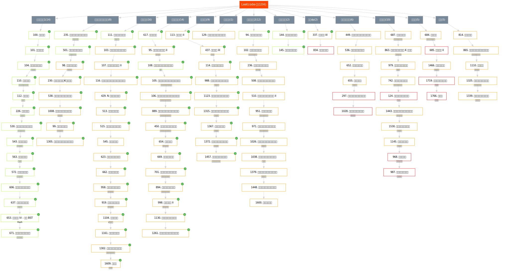
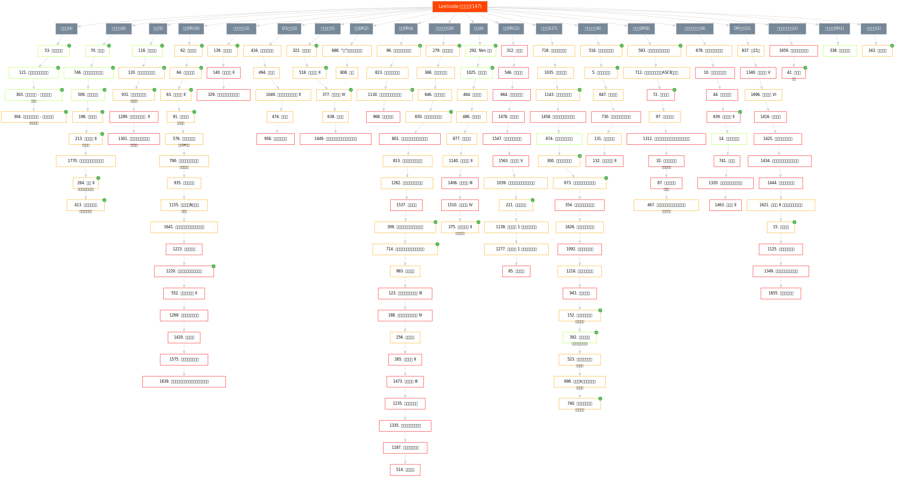
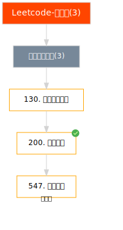
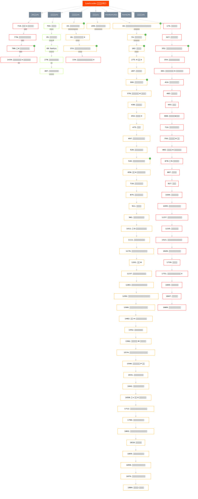
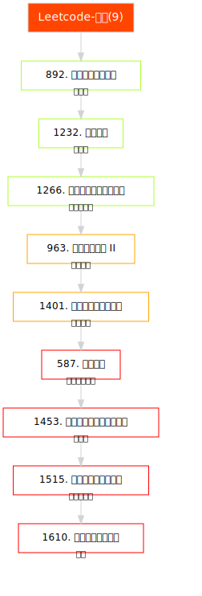

<!--
 * @Author       : Scallions
 * @Date         : 2020-03-19 21:07:37
 * @LastEditors  : Scallions
 * @LastEditTime : 2021-10-01 20:58:06
 * @FilePath     : /algorithm-ex/README.md
 * @Description  : 
 -->

# algorithm-ex

本项目用来储存各种语言的一些数据结构和常用算法

## 项目结构

- structure
  - list
  - dict
  - tuple
  - ...
- algorithm
  - sort
  - ...

### Leetcode路线图合集
采用[acm-clan/algorithm-stone](https://github.com/acm-clan/algorithm-stone)的脚本生成
#### Tree路线图  

#### 动态规划路线图

<!-- #### 并查集路线图
 -->

#### 堆栈队列路线图

#### 链表路线图

#### 二分查找

#### 几何题路线图

#### 小众题路线图

### Codeforces Div.3 Div.2路线图
